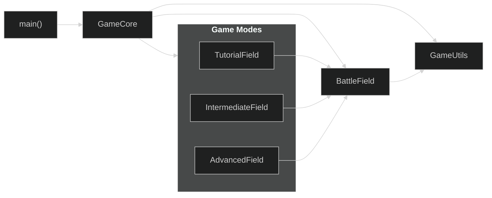
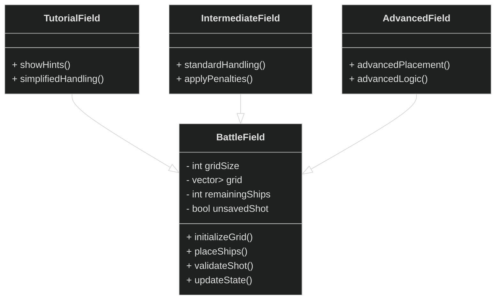

# Software Architecture

  <a href="#overview">Overview</a> •
  <a href="#architectural-components">Components</a> •
  <a href="#component-interaction-diagram">Interaction Diagram</a> •
  <a href="#class-diagram">Class Diagram</a> •
  <a href="#mapping-to-codebase">Mapping to Codebase</a>

---

## Overview

The **Battleship** project is designed using a **modular, maintainable, and scalable architecture**, separating:

- **Core game logic**
- **Difficulty-specific behavior**
- **Auxiliary utilities**

This architecture enables:

- Efficient **development and testing**
- Future **extensibility** (new game modes or utilities)
- Clear **separation of concerns** across modules

---

## Architectural Components

| Component          | Responsibility |
|-------------------|----------------|
| **GameCore**       | Central orchestrator of the game; coordinates **BattleField**, **Game Modes**, and **Utilities**. |
| **BattleField**    | Implements shared battlefield logic and grid management across all difficulty levels. |
| **Game Modes**     | Encapsulate difficulty-specific behavior: **TutorialField**, **IntermediateField**, **AdvancedField**. |
| **GameUtils**      | Provides reusable helper functions shared across modules. |
| **Main**           | Entry point of the application; initializes **GameCore** and starts the main game loop. |

---

## Component Interaction Diagram

> [!TIP]
> Difficulty-specific modules extend or modify behavior without duplicating core logic.

---

## Class Diagram

> [!NOTE]
> - Each difficulty class inherits from **BattleField** to reuse core logic.
> - Design follows single responsibility and extensibility principles.

---

## Mapping to Codebase

| Component             | Header                              | Source                            |
| --------------------- | ----------------------------------- | --------------------------------- |
| **GameCore**          | `include/GameCore.h`                | N/A                               |
| **BattleField**       | `include/field/BattleField.h`       | `src/field/BattleField.cpp`       |
| **TutorialField**     | `include/modes/TutorialField.h`     | `src/modes/TutorialField.cpp`     |
| **IntermediateField** | `include/modes/IntermediateField.h` | `src/modes/IntermediateField.cpp` |
| **AdvancedField**     | `include/modes/AdvancedField.h`     | `src/modes/AdvancedField.cpp`     |
| **GameUtils**         | `include/utils/GameUtils.h`         | `src/utils/GameUtility.cpp`       |
| **Main**              | N/A                                 | `src/main.cpp`                    |
