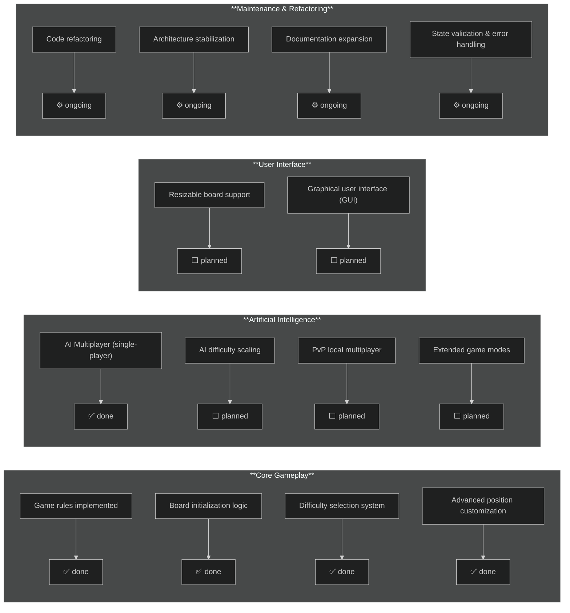

# Project Roadmap

This document provides a structured overview of the **Battleship** project, detailing implemented features, ongoing work, and planned enhancements.
It serves as a **technical reference** and a **development roadmap** for contributors, maintainers, and stakeholders.

---

## Status Legend

| Symbol | Meaning |
|--------|---------|
| ✅ done | Feature fully implemented and tested |
| ⚙ ongoing | Work in progress or under review |
| ⬜ planned | Feature planned for future implementation |

---

## Implemented Features

- [x] Core game rules
- [x] Difficulty selection
- [x] Advanced position customization
- [x] AI multiplayer mode (single-player)

---

## Planned Features

- [ ] Resizable game board
- [ ] Difficulty selection for AI multiplayer
- [ ] Player vs Player (PvP) mode
- [ ] Graphical user interface (GUI)

---

## Development Roadmap

The diagram below visualizes the **current status** of core gameplay, AI, user interface, and maintenance tasks.

> [!NOTE]
> - The roadmap is reviewed periodically to ensure alignment with project milestones and release objectives.
> - Feature availability and priorities may evolve as refactoring and new development cycles proceed.
> - Contributions, suggestions, and improvement proposals are encouraged via [GitHub issues](https://github.com/marsetech/battleship/issues) or discussions.
